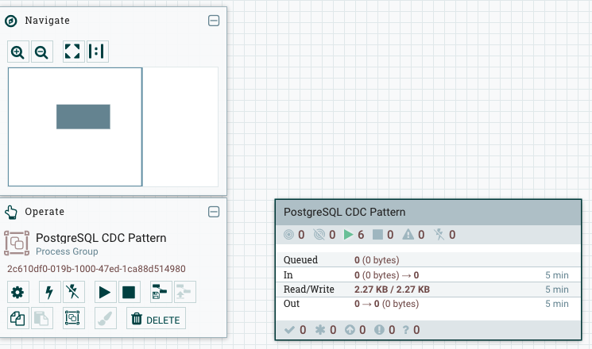
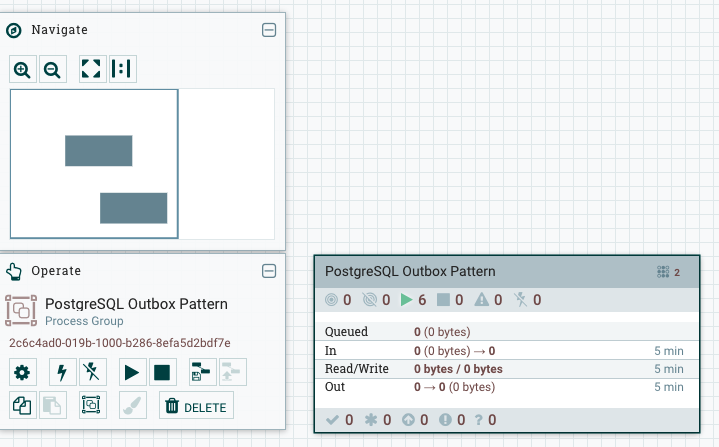

# Apache NiFi CDC & Outbox Pattern Testing Guide

This guide walks you through testing both the CDC (Change Data Capture) and Outbox patterns with PostgreSQL and Apache NiFi.

## Prerequisites

- Docker and Docker Compose installed
- `jq` installed (for JSON processing in scripts)
- `.env` file configured (copy from `env-tmplt` if needed)

## Start the environment

```sh
docker-compose up -d
```

### Status check, you may have to wait a bit

check nifi status
```sh
# check regularly if the nifi endpoint is available
until curl -s -k https://localhost:8443/nifi > /dev/null; do sleep 1; done && echo "NiFi is ready"

# follow docker compose logs indefinitely
docker-compose logs -f nifi

# check existing logs (won't hang)
docker-compose logs nifi 2>&1 | grep -E "Started Application|listening"
```

once you see `NiFi has started`, NiFi should be available at [https://localhost:8443/nifi](https://localhost:8443/nifi).
_Please_ note the browser warning and accept the self-signed certificate.

Login with user name and password provided defined in your `.env` file.


verify environment variables are loaded
```sh
docker-compose config
```


make scripts executable in not done already
```sh
chmod +x nifi-cdc-setup.sh nifi-outbox-setup.sh test-cdc.sh test-outbox.sh nifi-diagnose.sh monitor-cdc-slot.sh monitor-outbox-slot.sh
```

## CDC

### Run CDC setup script
```sh
./nifi-cdc-setup.sh
```

### Create replication slot (if not exists):
```sh
./test-cdc.sh --setup
```

### Start the flow in NiFi UI



### Generate test data

```sh
./test-cdc.sh
# run continuously to prepare real-time monitoring below
./test-cdc.sh --continuous
```

### CDC Monitoring incl. Slot Monitoring

Monitor replication slots for WAL growth and lag to prevent disk space issues:

```sh
./monitor-cdc-slot.sh
# run continuously for real-time monitoring
./monitor-cdc-slot.sh --continuous
```

The monitoring script implements best practices from [PostgreSQL CDC Best Practices: Managing WAL Growth and Replication Slots](https://www.lotharschulz.info/2025/10/15/postgresql-cdc-best-practices-managing-wal-growth-and-replication-slots/):

1. **Monitor slot lag and activity** - Check for inactive slots that cause WAL accumulation
2. **Set WAL size limits** - Configure `max_slot_wal_keep_size` to prevent unlimited growth
3. **Remove unused slots** - Drop replication slots that are no longer needed

Key metrics monitored:
- Slot activity status (active/inactive)
- WAL lag size (how far behind the slot is)
- Safe WAL size (remaining safe space)
- WAL configuration settings

**Warning System:**
- **Warning** (⚠️): Only shown when BOTH inactive AND lag_size > 500 MB (indicates a real problem)
- **Debug** (🔍): Shown for inactive slots with detailed context explaining expected behavior for scheduled CDC consumers


## Outbox


### Run Outbox setup script
```sh
./nifi-outbox-setup.sh
```

### Start the flow in NiFi UI



### Generate test data
```sh
./test-outbox.sh
```

### Check
```sh
docker exec nifi_database psql -U demo_user -d demo_db -c "SELECT COUNT(*) FROM outbox;"
# result set should be zero when all events are consumed
```

### Generate test data continuously
```sh
# run continuously to prepare real-time monitoring below
./test-outbox.sh --continuous
```

### Outbox Monitoring

Monitor the outbox table for pending events and processing metrics:

```sh
./monitor-outbox-slot.sh
# run continuously for real-time monitoring
./monitor-outbox-slot.sh --continuous
```

The monitoring script provides insights into:
- Pending events count and distribution
- Event age analysis (warns if events are older than 5 minutes)
- Aggregate type distribution
- Recent events listing
- Table size statistics

**Warning System:**
- **Warning** (⚠️): Shown when events are older than 5 minutes (indicates consumer issues)
- **Success** (✓): All events are recent and being processed properly


## Diagnostics and Monitoring

### Run diagnostic check

Check the status of both CDC and Outbox patterns, including CDC slot monitoring:

```sh
./nifi-diagnose.sh
```

The diagnostic script will show:
- Docker container status
- NiFi connectivity and authentication
- Process group and processor status
- Controller service status
- PostgreSQL database connectivity
- Table information and row counts
- Replication slot status and pending changes
- **CDC Slot Monitoring** with WAL lag and slot activity metrics


## Tear down

```sh
# Data is preserved in Docker volumes. To remove volumes as well (irreversible), run:
docker-compose down -v 
```

### restart from scratch

```sh
docker-compose down -v && sleep 1 && docker-compose up -d
```
